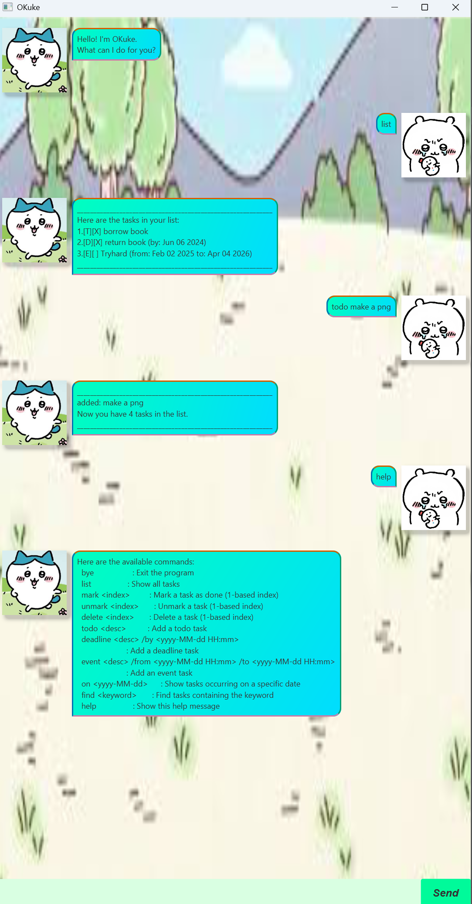

# Okuke

Okuke is a **desktop app for managing tasks**, optimized for use via a **Command Line Interface (CLI)** but comes with a JavaFX GUI.  
It is lightweight, fast, and helps you keep track of your todos, deadlines, and events — all from your keyboard.

---

## 📸 Preview

---

## ✨ Features

- Manage tasks of different types: **Todo**, **Deadline**, and **Event**.
- Mark tasks as done ✅ or undo them ❌.
- Delete tasks you no longer need.
- Search and filter tasks with keywords.
- Simple `help` command to guide you.
- All optimized for **fast CLI input**.

---

## 💻 Commands

| Command   | Format & Example                                                                 | Description                                                                 |
|-----------|----------------------------------------------------------------------------------|-----------------------------------------------------------------------------|
| `help`    | `help`                                                                           | Shows the list of available commands.                                       |
| `todo`    | `todo <description>`   e.g. `todo read book`                                  | Adds a Todo task.                                                           |
| `deadline`| `deadline <description> /by <yyyy-MM-dd HH:mm>`   e.g. `deadline return book /by 2025-09-20 23:59` | Adds a Deadline task with a due date and time.                              |
| `event`   | `event <description> /from <yyyy-MM-dd HH:mm> /to <yyyy-MM-dd HH:mm>`   e.g. `event project meeting /from 2025-09-21 14:00 /to 2025-09-21 16:00` | Adds an Event task with start and end time.                                |
| `mark`    | `mark <index>`   e.g. `mark 2`                                                | Marks the task at the given index as done.                                  |
| `unmark`  | `unmark <index>`   e.g. `unmark 2`                                            | Unmarks the task at the given index.                                        |
| `delete`  | `delete <index>`   e.g. `delete 3`                                            | Deletes the task at the given index.                                        |
| `find`    | `find <keyword>`   e.g. `find book`                                           | Displays all tasks whose description contains the keyword.                  |
| `bye`     | `bye`                                                                            | Exits the application.                                                      |

---

## 🚀 Getting Started

1. Ensure that you have Java 17 or above installed on your Computer.
2. Download the latest .jar file
3. Copy the file to the directory you want
4. Navigate to the directory of the .jar file in your terminal and use the command `java -jar OKuke.jar`